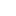

# Table des icones

Voici une liste des icônes utilisées dans ce projet, accompagnée de leur sigle.

## Arrows
| Icône                                                                              | Sigle |
|------------------------------------------------------------------------------------|-------|
|    | [v]   |
|        | [^]   |
|  | [>]   |
|    | [<]   |

## Roads
| Icône                                                                              | Sigle |
|------------------------------------------------------------------------------------|-------|
|                | [EX]  |
|        | [HW]  |

## Signalisation
| Icône                                                                              | Sigle |
|------------------------------------------------------------------------------------|-------|
|        | [!PL] |
|              | [PL]  |

## Infrastructures
| Icône                                                                              | Sigle |
|------------------------------------------------------------------------------------|-------|
|         | [AP]  |
